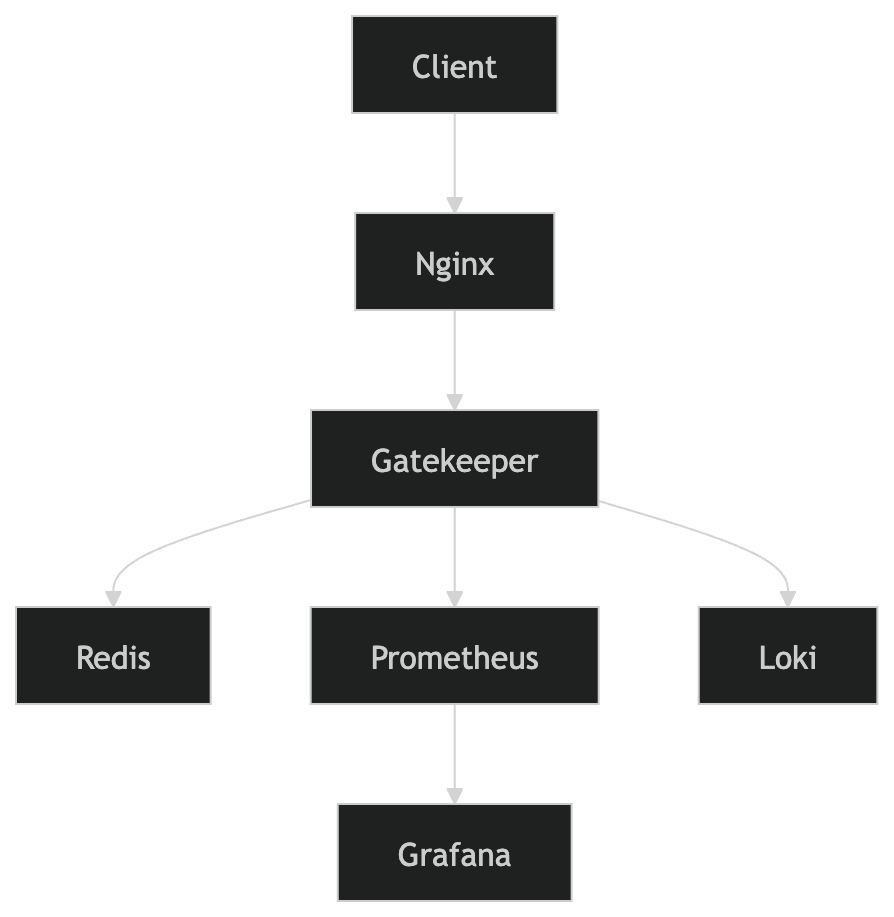

# 📌 Gatekeeper

**Lightweight Distributed Rate Limiter Service written in Go**

Gatekeeper is a production-oriented backend infrastructure service designed to demonstrate real-world backend and DevOps engineering practices including rate limiting, observability, and containerized deployment.

---

# 🚀 Features

* IP-based rate limiting
* API key / user-based rate limiting (extensible)
* Redis-backed distributed state
* Token bucket rate limiting algorithm
* HTTP middleware-based architecture
* Structured JSON logging
* Request tracing with correlation IDs
* Prometheus metrics integration
* Grafana dashboards support
* Loki log aggregation support
* Healthcheck endpoint
* Graceful shutdown
* Dockerized setup (production-friendly)

---

# 🧱 Architecture


---

# ⚙️ Tech Stack

* **Go**
* **Redis**
* **Docker / Docker Compose**
* **Nginx**
* **Prometheus**
* **Grafana**
* **Loki + Promtail**

---

# 🧠 How It Works

1. Incoming request hits Nginx reverse proxy
2. Request forwarded to Gatekeeper API
3. Middleware chain executes:

   * Request ID injection
   * Rate limiting (Redis-backed)
   * Metrics collection
   * Structured logging
4. Response returned to client
5. Metrics scraped by Prometheus
6. Logs shipped to Loki via Promtail

---

# 📊 Observability

## Metrics (Prometheus)

Available metrics:

* `gatekeeper_requests_total`
* `gatekeeper_request_duration_seconds`
* `gatekeeper_rate_limit_blocked_total`

Example PromQL:

```promql
rate(gatekeeper_requests_total[1m])
```

```promql
histogram_quantile(
  0.95,
  rate(gatekeeper_request_duration_seconds_bucket[5m])
)
```

---

## Logs (Loki)

Structured logs are shipped via Promtail and available in Grafana.

Example query:

```logql
{container="gatekeeper"} |= "request completed"
```

---

## Dashboards (Grafana)

Includes:

* Request rate (RPS)
* Error rate
* p95 latency
* Rate limit blocks

---

# 📡 API

## Health Check

```http
GET /health
```

Response:

```json
{
  "status": "ok"
}
```

---

## Example Endpoint

```http
GET /api/test
```

---

## Metrics

```http
GET /metrics
```

Prometheus scrape endpoint.

---

# 🧪 Rate Limiting

Gatekeeper uses a **Redis-backed token bucket algorithm**.

### Behavior:

* Each IP / API key has a bucket
* Requests consume tokens
* When empty → request is blocked (HTTP 429)

---

# 🐳 Run Locally (Docker Compose)

```bash
git clone https://github.com/your-username/gatekeeper.git
cd gatekeeper

docker compose up -d --build
```

---

# 📍 Services

| Service    | URL                                                            |
| ---------- | -------------------------------------------------------------- |
| API        | [http://localhost:8080](http://localhost:8080)                 |
| Metrics    | [http://localhost:8080/metrics](http://localhost:8080/metrics) |
| Prometheus | [http://localhost:9090](http://localhost:9090)                 |
| Grafana    | [http://localhost:3000](http://localhost:3000)                 |
| Loki       | [http://localhost:3100](http://localhost:3100)                 |

---

# 🔐 Environment Variables

```env
REDIS_ADDR=redis:6379
PORT=8080
RATE_LIMIT_RPS=10
```

---

# 📁 Project Structure

```text
cmd/gatekeeper/        # application entrypoint
internal/
  http/                # HTTP handlers
  middleware/         # request middleware
  metrics/            # Prometheus metrics
  ratelimit/         # rate limiting logic
  logger/            # structured logging
  config/            # config management

deployments/
  docker/
  nginx/
  prometheus/
  grafana/
  loki/

docs/
  architecture.md
```

---

# 📈 Production Considerations

* Stateless API layer
* Redis used as distributed store
* Metrics exposed via Prometheus endpoint
* Logs centralized via Loki
* Reverse proxy via Nginx
* Graceful shutdown implemented
* Structured logging for observability
* Low-cardinality Prometheus labels

---

# 🔥 Key Design Decisions

### 1. Redis-backed rate limiting

Ensures horizontal scalability.

### 2. Middleware-based architecture

Keeps core business logic clean and testable.

### 3. Prometheus + Histogram metrics

Enables latency analysis (p95/p99).

### 4. Loki for logs instead of local files

Enables centralized debugging.

---

# 📊 Example Prometheus Queries

### Request rate

```promql
rate(gatekeeper_requests_total[1m])
```

### Error rate

```promql
sum(rate(gatekeeper_requests_total{status=~"4..|5.."}[1m]))
```

### Rate limit blocks

```promql
rate(gatekeeper_rate_limit_blocked_total[1m])
```

---

# 🧪 Example Log Query (Grafana Loki)

```logql
{container="gatekeeper"} |= "rate limit"
```

---

# 🚀 Future Improvements

* API key authentication layer
* Distributed tracing (OpenTelemetry)
* Load testing (k6 integration)
* SLO / alerting rules
* Multi-region deployment
* Redis cluster support

---

# 👨‍💻 Author

Built as a backend + DevOps portfolio project to demonstrate:

* Production-ready Go services
* Observability stack design
* Infrastructure thinking
* System design fundamentals

---

# 📌 Summary

Gatekeeper is a minimal but production-oriented rate limiting service designed to demonstrate real-world backend engineering practices without unnecessary complexity.

